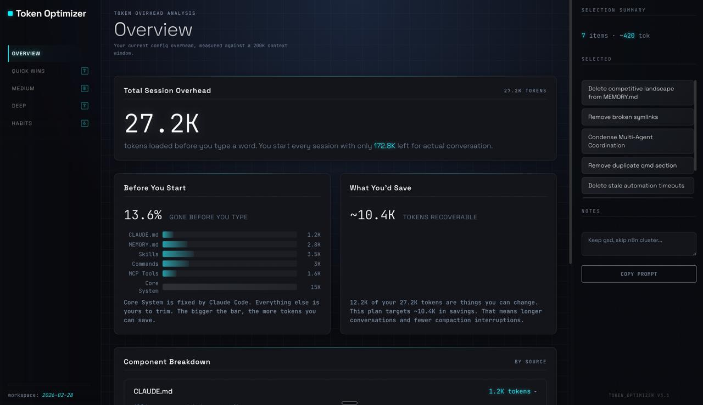

<p align="center">
  
</p>

<p align="center">
  <a href="https://github.com/alexgreensh/token-optimizer/releases"></a>
  <a href="https://github.com/alexgreensh/token-optimizer"></a>
  <a href="https://github.com/alexgreensh/token-optimizer/tree/main/openclaw"></a>
  <a href="https://github.com/alexgreensh/token-optimizer/blob/main/LICENSE"></a>
  <a href="https://github.com/alexgreensh/token-optimizer/stargazers"></a>
  <a href="https://github.com/alexgreensh/token-optimizer/commits/main"></a>
  
  
  <a href="https://linkedin.com/in/alexgreensh"></a>
</p>

<h2 align="center">Your AI is getting dumber and you can't see it.</h2>

<p align="center"><em>Find the ghost tokens. Survive compaction. Track the quality decay.</em></p>

<p align="center">
Opus 4.6 drops from 93% to 76% accuracy across a 1M context window. Compaction loses 60-70% of your conversation. Ghost tokens burn through your plan limits on every single message. Token Optimizer tracks the degradation, cuts the waste, checkpoints your decisions before compaction fires, and tells you what to fix.
</p>

<p align="center">
  
</p>

## Install

```bash
/plugin marketplace add alexgreensh/token-optimizer
```

Then in Claude Code: `/token-optimizer`

Also available as a script install:

```bash
git clone https://github.com/alexgreensh/token-optimizer.git ~/.claude/token-optimizer
bash ~/.claude/token-optimizer/install.sh
```

That install path still keeps automatic updates, because script-installed checkouts run a daily `git pull --ff-only`.

Works on Claude Code and [OpenClaw](#openclaw-plugin). Each platform gets its own native plugin (Python for Claude Code, TypeScript for OpenClaw). No bridging, no shared runtime, zero cross-platform dependencies.

## What makes this different?

`/context` tells you your context is 73% full. Token Optimizer tells you WHY,
shows you which 12K tokens are wasted on skills you never use, checkpoints your
decisions before compaction destroys them, and gives you a quality score that
tracks how much dumber your AI is getting as the session goes on.

One shows the dashboard light. The other opens the hood.

## Why install this first?

Every Claude Code session starts with invisible overhead: system prompt, tool definitions, skills, MCP servers, CLAUDE.md, MEMORY.md. A typical power user burns 50-70K tokens before typing a word.

At 200K context, that's 25-35% gone. At 1M, it's "only" 5-7%, but the problems compound:

- **Quality degrades as context fills.** MRCR drops from 93% to 76% across 256K to 1M. Your AI gets measurably dumber with every message.
- **You hit rate limits faster.** Ghost tokens count toward your plan's usage caps on every message, cached or not. 50K overhead x 100 messages = 5M tokens burned on nothing.
- **Compaction is catastrophic.** 60-70% of your conversation gone per compaction. After 2-3 compactions: 88-95% cumulative loss. And each compaction means re-sending all that overhead again.
- **Higher effort = faster burn.** More thinking tokens per response means you hit compaction sooner, which means more total tokens consumed across the session.

Token Optimizer tracks all of this. Quality score, degradation bands, compaction loss, drift detection. Zero context tokens consumed (runs as external Python).

> **"But doesn't removing tokens hurt the model?"** No. Token Optimizer removes structural waste (duplicate configs, unused skill frontmatter, bloated files), not useful context. It also actively *measures* quality: the 7-signal quality score tells you if your session is degrading, and Smart Compaction checkpoints your decisions before auto-compact fires. Most users see quality scores *improve* after optimization because the model has more room for real work.

---

### NEW in v3.1: Efficiency Grading, Read-Cache, Git-Context, .contextignore

| Feature | What You Get |
|---------|-------------|
| **Efficiency Grading** | Every quality score now shows a letter grade (S/A/B/C/D/F). Status line shows `ContextQ:A(82)`. Dashboard badges, coach tab, and CLI output all include grades. At a glance: S is peak, F means your context is rotting. |
| **PreToolUse Read-Cache** | Detects redundant file reads and optionally blocks them with structural digests. Default ON (warn mode). Opt out: `TOKEN_OPTIMIZER_READ_CACHE=0` or config `{"read_cache_enabled": false}`. Upgrade to `TOKEN_OPTIMIZER_READ_CACHE_MODE=block` after gaining confidence. Saves 8-30% tokens from read deduplication. |
| **Git-Aware Context** | `git-context` command analyzes your working tree to suggest files that should be in context: test companions, frequently co-changed files from last 50 commits, and import chains for Python/JS/TS. |
| **.contextignore** | Block files from being read with gitignore-style patterns. Project root `.contextignore` + global `~/.claude/.contextignore`. Hard block regardless of read-cache mode. |
| **Performance** | PostToolUse archive-result extracted to standalone script (~40ms, saves 13-18s per session). Read-cache default ON. Per-session decision logs. |

```bash
# Read-cache is ON by default (warn mode). To disable:
export TOKEN_OPTIMIZER_READ_CACHE=0               # Disable
export TOKEN_OPTIMIZER_READ_CACHE_MODE=block       # Upgrade to block mode

# Git context suggestions
python3 measure.py git-context                     # Suggest files for current changes
python3 measure.py git-context --json              # Machine-readable output

# Read-cache management
python3 measure.py read-cache-stats --session ID   # Cache stats for a session
python3 measure.py read-cache-clear                # Clear all caches
```

Create `.contextignore` in your project root (provided by this plugin, not a built-in Claude Code feature):
```
# Block build artifacts and lockfiles
dist/**
node_modules/**
package-lock.json
yarn.lock
*.min.js
*.min.css
```

---

### v3.4.3: Claude Dashboard Drill-Downs + TTL Clarity

| Feature | What You Get |
|---------|-------------|
| **Stable Session Drill-Downs** | Session turn breakdowns now key off a stable session identity instead of fragile slugs, so the visible Claude dashboard rows expand much more consistently. |
| **TTL Visibility** | Session tables and turn deep dives now show cache TTL mix (`1h` vs `5m`) alongside the existing cache hit metrics. |
| **Pacing Metrics** | Session rows and per-turn breakdowns now show time between calls so users can see whether a thread was steady or stop-start. |
| **User-First Explanations** | Hover help was added for session and turn columns so users can understand `Cache`, `TTL`, `Pacing`, `Cache R`, and `Cache W` without knowing the jargon. |
| **Served Dashboard Fallback** | The served dashboard can now fetch older session turn breakdowns on demand, while the local static dashboard keeps the default 7-day slice preloaded for speed. |

---

### v3.4.2: Security Posture Cleanup

| Feature | What You Get |
|---------|-------------|
| **Safer Script Install Docs** | README now points to clone-and-run install steps instead of advertising `curl | bash`, while keeping auto-updates for script-installed users. |
| **Forensics Review** | Repo-forensics review confirmed no outbound exfiltration path in the shipped plugin code; scanner noise is documented and the trust-posture concern is reduced. |

---

### v3.4.1: Combined Checkpoint Policy + Local Telemetry

| Feature | What You Get |
|---------|-------------|
| **Combined Checkpoints** | Captures session state at `20%`, `35%`, `50%`, `65%`, and `80%` fill, plus first quality drops below `80`, `70`, `50`, and `40`. Also snapshots before agent fan-out and after big edit batches. |
| **Background Guards** | One-shot threshold capture, cooldown suppression, and deterministic checkpoint extraction. No LLM calls in the checkpoint path. |
| **Local Checkpoint Telemetry** | Optional, local-only telemetry. Enable with `TOKEN_OPTIMIZER_CHECKPOINT_TELEMETRY=1` to see whether checkpoints are firing, which triggers are active, and the last captured event. No external analytics. |
| **OpenClaw Doctor** | OpenClaw now includes checkpoint health plus recent-event visibility through `token-optimizer doctor` and `token-optimizer checkpoint-stats`. |
| **Restore Hardening** | Automatic restore and cleanup reject symlinked checkpoint files and out-of-root paths. |

```bash
TOKEN_OPTIMIZER_CHECKPOINT_TELEMETRY=1 python3 measure.py checkpoint-stats --days 7
TOKEN_OPTIMIZER_CHECKPOINT_TELEMETRY=1 npx token-optimizer checkpoint-stats --days 7
```

---

### v3.0: Progressive Checkpoints, Tool Archive, Savings Tracking, JSONL Toolkit, Attention Optimizer

| Feature | What You Get |
|---------|-------------|
| **Progressive Checkpoints** | Captures session state early and restores from the richest eligible checkpoint instead of waiting for emergency compaction. |
| **Tool Result Archive** | PostToolUse hook archives large tool results (>4KB) to disk. After compaction, use `expand <tool-use-id>` to retrieve any archived result instead of re-running the command. MCP tool results over 8KB get automatically trimmed with an expand hint. |
| **Savings Dashboard** | Tracks cumulative dollar savings from setup optimization, checkpoint restores, and tool archiving. `savings` command shows a breakdown by category with daily averages and monthly estimates. |
| **JSONL Toolkit** | Three utilities for session JSONL files: `jsonl-inspect` (stats, record counts, largest records), `jsonl-trim` (replace large tool results with placeholders), `jsonl-dedup` (detect and remove duplicate system reminders). All use streaming I/O and atomic writes. |
| **Attention Optimizer** | Scores CLAUDE.md against the U-shaped attention curve. Flags critical rules (NEVER/ALWAYS/MUST) sitting in the low-attention zone (30-70% position). `attention-optimize` generates a reordered version that moves critical rules to high-attention zones. |

```bash
python3 measure.py savings                      # Dollar savings report (last 30 days)
python3 measure.py attention-score               # Score CLAUDE.md attention placement
python3 measure.py attention-optimize --dry-run  # Preview optimized section order
python3 measure.py jsonl-inspect                 # Stats on current session JSONL
python3 measure.py jsonl-trim --dry-run          # Preview trimming large tool results
python3 measure.py jsonl-dedup --dry-run         # Preview removing duplicate reminders
python3 measure.py expand --list                 # List all archived tool results
python3 measure.py expand <tool-use-id>          # Retrieve a specific archived result
```

---

### v2.6: Per-Turn Analytics and Cost Intelligence

| Feature | What You Get |
|---------|-------------|
| **Per-turn token breakdown** | Click any session to see input/output/cache per API call. Spike detection highlights context jumps. |
| **Cost per session** | Every session shows estimated API cost. Daily totals in the trends view. |
| **Four-tier pricing** | Anthropic API, Vertex Global, Vertex Regional (+10%), AWS Bedrock. Set once, all costs update. |
| **Cache visualization** | Stacked bars showing input vs output vs cache-read vs cache-write split. See how well prompt caching works. |
| **Session quality overlay** | Color-coded quality scores on every session. Green = healthy, yellow = degrading, red = trouble. |
| **Kill stale sessions** | Terminates zombie headless sessions. Dashboard shows kill buttons with clear explanation. |
| **Live agent tracking** | Status bar shows running subagents with model, description, and elapsed time. Spot misrouted models instantly. |
| **Session duration warning** | Appears in the status bar only when quality drops below 75. Contextual, not noise. |

```bash
python3 measure.py conversation              # Per-turn breakdown (current session)
python3 measure.py conversation <session-id>  # Per-turn breakdown (specific session)
python3 measure.py pricing-tier               # View/set pricing tier
python3 measure.py pricing-tier vertex-regional  # Switch to Vertex Regional pricing
python3 measure.py kill-stale                 # Kill sessions running >12h
python3 measure.py kill-stale --dry-run       # Preview without killing
```

---

### What questions can you ask?

| Command | What You Get |
|---------|-------------|
| `quick` | **"Am I in trouble?"** 10-second answer: context health, degradation risk, biggest token offenders, which model to use. |
| `doctor` | **"Is everything installed correctly?"** Score out of 10. Broken hooks, missing components, exact fix commands. |
| `drift` | **"Has my setup grown?"** Side-by-side comparison vs your last snapshot. Catches config creep before it costs you. |
| `quality` | **"How healthy is this session?"** 7-signal analysis of your live conversation. Stale reads, wasted tokens, compaction damage. |
| `report` | **"Where are my tokens going?"** Full per-component breakdown. Every skill, every MCP server, every config file. |
| `conversation` | **"What happened each turn?"** Per-message token + cost breakdown with spike detection. |
| `pricing-tier` | **"What am I paying?"** View or switch between Anthropic/Vertex/Bedrock pricing tiers. |
| `kill-stale` | **"Clean up zombies."** Terminate headless sessions running 12+ hours. |
| `git-context` | **"What files matter right now?"** Test companions, co-changed files, import chains for your current git diff. |
| `trends` | **"What's actually being used?"** Skill adoption, model mix, overhead trajectory over time. |
| `coach` | **"Where do I start?"** Detects 8 named anti-patterns and recommends specific fixes. |
| `dashboard` | **"Show me everything."** Interactive HTML dashboard with all analytics. |
| `savings` | **"How much have I saved?"** Cumulative dollar savings from optimizations, checkpoint restores, and archives. |
| `attention-score` | **"Is my CLAUDE.md well-structured?"** Scores sections against the attention curve, flags critical rules in low-attention zones. |
| `jsonl-inspect` | **"What's in this session?"** Record counts, token distribution, top 10 largest records, compaction markers. |
| `expand` | **"Get that result back."** Retrieves tool results archived before compaction. Never re-run a command twice. |
| `/token-optimizer` | **"Fix it for me."** Interactive audit with 6 parallel agents. Guided fixes with diffs and backups. |

### Quality Scoring (7 signals)

| Signal | Weight | What It Means For You |
|--------|--------|----------------|
| **Context fill** | 20% | How close are you to the degradation cliff? Based on published MRCR benchmarks. |
| **Stale reads** | 20% | Files you read earlier have changed. Your AI is working with outdated info. |
| **Bloated results** | 20% | Tool outputs that were never used. Wasting context on noise. |
| **Compaction depth** | 15% | Each compaction loses 60-70% of your conversation. After 2: 88% gone. |
| **Duplicates** | 10% | The same system reminders injected over and over. Pure waste. |
| **Decision density** | 8% | Are you having a real conversation or is it mostly overhead? |
| **Agent efficiency** | 7% | Are your subagents pulling their weight or just burning tokens? |

Degradation bands in the status bar:
- Green (<50% fill): peak quality zone
- Yellow (50-70%): degradation starting
- Orange (70-80%): quality dropping
- Red (80%+): severe, consider /clear

### What Degradation Actually Looks Like

This is a real session. 708 messages, 2 compactions, 88% of the original context gone. Without the quality score, you'd have no idea.



---

## The Problem

Every message you send to Claude Code re-sends everything: system prompt, tool definitions, MCP servers, skills, commands, CLAUDE.md, MEMORY.md, and system reminders. The API is stateless. These are the ghost tokens: invisible overhead that eats your context window before you type a word.

Prompt caching makes this [cheaper](https://code.claude.com/docs/en/costs) (90% cost reduction on cached tokens). But cheaper doesn't mean free, and it doesn't mean small. Those tokens still fill your context window, still count toward your plan's rate limits on every message, and still degrade output quality. On Claude Max or Pro, ghost tokens eat into the same usage caps you need for actual work.

The more you've customized Claude Code, the worse it gets. And at 1M, the real problem isn't startup overhead, it's the compounding cost: degradation as the window fills, plus rate limit burn from overhead you never see.


### Where it all goes

**Fixed overhead** (everyone pays): System prompt (~3K tokens) plus built-in tool definitions (12-17K tokens). About 8-10% at 200K, or 1.5-2% at 1M.

**Autocompact buffer**: ~30-35K tokens (~16%) reserved for compaction headroom.

**MCP tools**: The biggest variable. Anthropic's team [measured 134K tokens consumed by tool definitions](https://www.anthropic.com/engineering/advanced-tool-use) before optimization. [Tool Search](https://www.anthropic.com/engineering/advanced-tool-use) reduced this by 85%, but servers still add up.

**Your config stack** (what this tool optimizes): CLAUDE.md that's grown organically. MEMORY.md that duplicates half of it. 50+ skills you installed and forgot. Commands you never use. [`@imports`](https://code.claude.com/docs/en/memory). [`.claude/rules/`](https://code.claude.com/docs/en/memory). No `permissions.deny` rules.

## What This Does

One command. Six parallel agents audit your entire setup. Prioritized fixes with exact token savings. Everything backed up before any change.



You see diffs. You approve each fix. Nothing irreversible.

### What it audits

| Area | What It Catches |
|------|----------------|
| **CLAUDE.md** | Content that should be skills or reference files. Duplication with MEMORY.md. [`@imports`](https://code.claude.com/docs/en/memory). Poor cache structure. |
| **MEMORY.md** | Overlap with CLAUDE.md. Verbose entries. Content past the [200-line auto-load cap](https://code.claude.com/docs/en/memory). |
| **Skills** | Unused skills loading frontmatter (~100 tokens each). Duplicates. Wrong directory. |
| **MCP Servers** | Broken/unused servers. Duplicate tools. Missing [Tool Search](https://www.anthropic.com/engineering/advanced-tool-use). |
| **Commands** | Rarely-used commands (~50 tokens each). |
| **Rules & Advanced** | [`.claude/rules/`](https://code.claude.com/docs/en/memory) overhead. Missing `permissions.deny`. No hooks. |

### The fix: progressive disclosure

| Where | Token Cost | What Goes Here |
|-------|-----------|----------------|
| **CLAUDE.md** | Every message (~800 token target) | Identity, critical rules, key paths |
| **Skills & references** | ~100 tokens in menu, full when invoked | Workflows, configs, standards |
| **Project files** | Zero until read | Guides, templates, documentation |

---

## Interactive Dashboard

After the audit, you get an interactive HTML dashboard.



Every component is clickable. Expand any item to see why it matters, what the trade-offs are, and what changes. Toggle the fixes you want, and copy a ready-to-paste optimization prompt.

### Persistent Dashboard

The dashboard auto-regenerates after every session (via the SessionEnd hook). Bookmark it and it's always up to date.

```bash
python3 measure.py setup-daemon     # Bookmarkable URL at http://localhost:24842/
python3 measure.py dashboard --serve # One-time serve over HTTP
```

---

## Smart Compaction: Don't Lose Your Work

When auto-compact fires, 60-70% of your conversation vanishes. Decisions, error-fix sequences, agent state: gone. Smart Compaction saves all of it as checkpoints before compaction, then restores what the summary dropped.

```bash
python3 measure.py setup-smart-compact    # checkpoint + restore hooks
```

### Live Quality Bar: Know Before It's Too Late

A glance at your terminal tells you if you're in trouble. Colors shift from green to red as quality degrades. When quality drops below 75, session duration appears as a warning. Running subagents show with their model and elapsed time so you can spot misrouted models.


```bash
python3 measure.py setup-quality-bar      # one-time install
```

### Session Continuity: Pick Up Where You Left Off

Sessions auto-checkpoint on end, /clear, and crashes. On a fresh session, Token Optimizer offers a pointer to the most recent relevant checkpoint instead of auto-injecting old context.

---

## Usage Analytics

**Trends**: Which skills do you actually invoke vs just having installed? Which models are you using? How has your overhead changed over time?

**Session Health**: Catches stale sessions (24h+), zombie sessions (48h+), and outdated configurations before they cause problems.

```bash
python3 measure.py setup-hook     # Enable session tracking (one-time)
python3 measure.py trends         # Usage patterns over time
python3 measure.py health         # Session hygiene check
```

## Coach Mode: Not Sure Where to Start?

```
> /token-coach
```

Tell it your goal. Get back specific, prioritized fixes with exact token savings. Detects 8 named anti-patterns (The Kitchen Sink, The Hoarder, The Monolith...) and recommends multi-agent design patterns that actually save context.

---

## How It Compares

| Capability | Token Optimizer | `/context` (built-in) | context-mode |
|---|---|---|---|
| Startup overhead audit | Deep (per-component) | Summary (v2.1.74+) | No |
| Quality degradation tracking | MRCR-based bands | Basic capacity % | No |
| Guided remediation | Yes, with token estimates | Basic suggestions | No |
| Runtime output containment | No | No | Yes (98% reduction) |
| Smart compaction survival | Progressive checkpoints + restore | No | Session guide |
| Tool result archive | Yes (cross-compaction recovery) | No | No |
| Dollar savings tracking | Yes (per-category breakdown) | No | No |
| JSONL session toolkit | Inspect, trim, dedup | No | No |
| Attention curve optimizer | Yes (CLAUDE.md reordering) | No | No |
| Model recommendation | Yes (Sonnet vs Opus by context) | No | No |
| Usage trends + dashboard | SQLite + interactive HTML | No | Session stats |
| Per-turn cost analytics | Yes (4 pricing tiers) | No | No |
| Compaction loss tracking | Yes (cumulative % lost) | No | Partial |
| Multi-platform | Claude Code + OpenClaw | Claude Code | 6 platforms |
| Context tokens consumed | 0 (Python script) | ~200 tokens | MCP overhead |

`/context` shows capacity. Token Optimizer fixes the causes.
context-mode prevents runtime floods. Token Optimizer prevents structural waste.

---

## VS Code Users

Using Claude Code in the VS Code extension? Most of Token Optimizer works identically:

| Feature | CLI | VS Code Extension |
|---------|-----|-------------------|
| Smart Compaction (checkpoint + restore) | Works | Works |
| Quality tracking + session data | Works | Works |
| All hooks (SessionEnd, PreCompact, etc.) | Works | Works |
| Dashboard (localhost:24842) | Works | Works |
| Status line (quality bar in terminal) | Works | Not available |

**The status line is CLI-only.** The VS Code extension doesn't support Claude Code's `statusLine` setting. This is a Claude Code limitation, not a Token Optimizer limitation.

**Best options for VS Code:**
- **Dashboard**: Bookmark `http://localhost:24842/` for always-current analytics. Run `python3 measure.py setup-daemon` to enable auto-refresh after every session.
- **Integrated terminal**: Run `claude` in VS Code's built-in terminal to get the full CLI experience, including the quality bar.
- **VS Code extension**: On the roadmap. [Follow #3](https://github.com/alexgreensh/token-optimizer/issues/3) for updates.

> **Note on `--bare` mode**: Running Claude Code with the `--bare` flag (for scripted/CI usage) skips all hooks and plugin sync. Token Optimizer's Smart Compaction, quality tracking, and session data collection require hooks and won't activate in `--bare` mode. This is expected, `--bare` is designed for lightweight scripted calls.

---

## OpenClaw Plugin

Native TypeScript plugin for OpenClaw agent systems. Zero Python dependency. Works with any model (Claude, GPT-5, Gemini, DeepSeek, local via Ollama). Reads your OpenClaw pricing config for accurate cost tracking, falls back to built-in rates for 20+ models.

```bash
# From GitHub (recommended)
openclaw plugins install github:alexgreensh/token-optimizer

# From ClawHub
openclaw plugins install token-optimizer

# From source
git clone https://github.com/alexgreensh/token-optimizer
cd token-optimizer/openclaw && npm install && npm run build
openclaw plugins install ./
```

Inside OpenClaw, run `/token-optimizer` for a guided audit with coaching.

**What it does:** Session parsing, cost calculation, waste detection (heartbeat model waste, empty runs, over-frequency, stale configs, session bloat, loops, abandoned sessions), and Smart Compaction (checkpoint/restore across compaction events).

**What's different from Claude Code:** The OpenClaw plugin includes its own 7-signal ContextQ with signals native to OpenClaw's architecture (Message Efficiency, Compression Opportunity, Model Routing, etc.) rather than a direct port of Claude Code's signals. Some Claude-specific signals (Stale Reads, Compaction Depth) don't apply to OpenClaw's stateless agent model.

See [`openclaw/README.md`](openclaw/README.md) for full docs.

---

## License

AGPL-3.0. See [LICENSE](LICENSE).

Created by [Alex Greenshpun](https://linkedin.com/in/alexgreensh).
